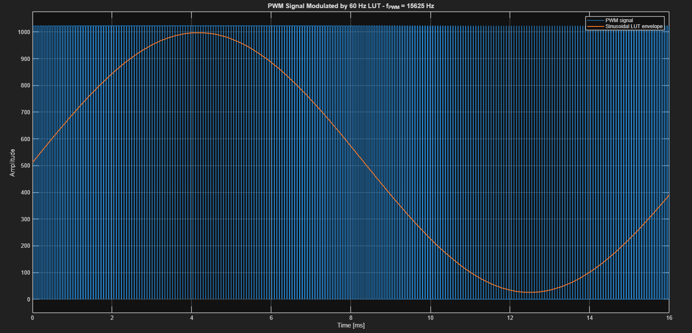
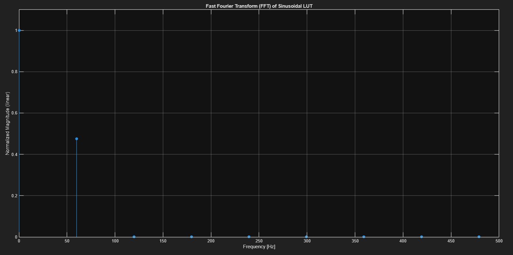
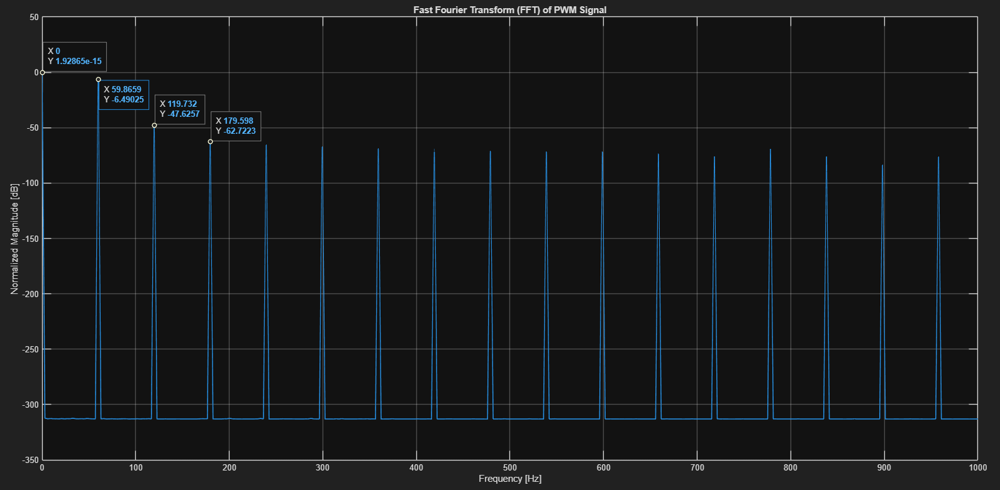
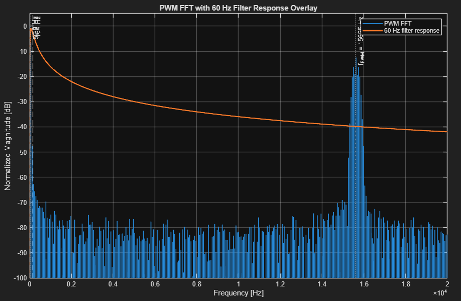
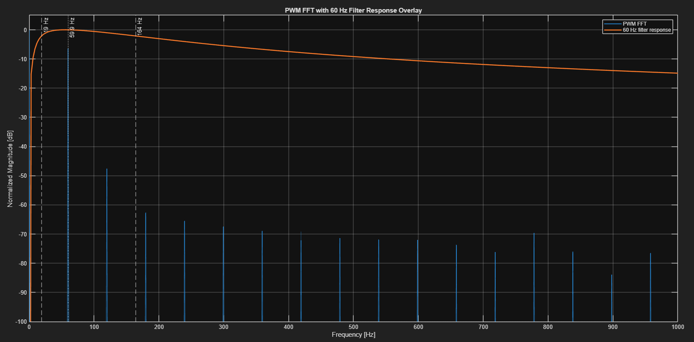
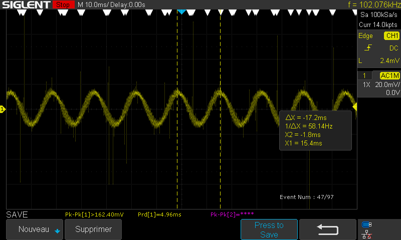
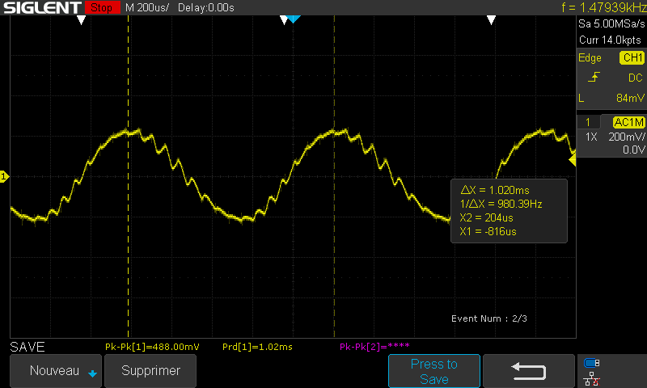

# Instrumentation Amplifier Test Bench with Microcontroller-Based Differential Signal Generator

#### Implementation of an instrumentation amplififer with PWM-generated differential and common-mode noise source

## Introduction

The aim of this repository is to help students, hobbyists and engineers build
a practical understanding of instrumentation amplifiers, differential signal
generation and common-mode rejection.

This project combines:
- microcontroller-based PWM signal generation,
- analog filtering techniques,
- differential and common-mode signal synthesis,
- and experimental instrumentation amplifier validation.

The generated signals are specifically designed to bench-test a 3-op-amp
instrumentation amplifier architecture under controlled differential and
common-mode noise conditions representative of ambient electromagnetic interference.

Two sinusoidal envelopes (~60 Hz and ~1 kHz) are reconstructed from PWM
carrier signals using analog filter stages. These signals are then combined
into differential and common-mode components in order to experimentally
evaluate common-mode rejection and signal recovery performance.

The repository also documents the complete hardware implementation,
including:
- breadboard prototyping,
- PCB design,
- firmware generation,
- analog filtering,
- and experimental validation.

## Table of Contents

- [Introduction](#introduction)

- [System Overview](#system-overview)
  - [Basics of PWM](#basics-of-pwm)
  - [Generating Sinusoidal Signals from Filtered PWM Carriers](#generating-sinusoidal-signals-from-filtered-pwm-carriers)
  - [Analog Filter Stages](#analog-filter-stages)
    - [First-Order Active High-Pass Filter](#first-order-active-high-pass-filter)
    - [First-Order Active Low-Pass Filter](#first-order-active-low-pass-filter)
    - [Second-Order Sallen-Key Low-Pass Filter](#second-order-sallen-key-low-pass-filter)

- [Differential Signal Generator](#differential-signal-generator)

- [Instrumentation Amplifier](#instrumentation-amplifier)

- [CMRR and Measured Performance](#cmrr-and-measured-performance)

- [Testing the Signal](#testing-the-signal)
  - [Viewing PWM Carrier Signals](#viewing-pwm-carrier-signals)
  - [Viewing Filtered Sinusoidal Signals](#viewing-filtered-sinusoidal-signals)
  - [Viewing Noisy Differential Signals](#viewing-noisy-differential-signals)
  - [Viewing Common-Mode Attenuation](#viewing-common-mode-attenuation)

- [Hardware Implementation](#hardware-implementation)
  - [Breadboard Prototype](#breadboard-prototype)
  - [PCB Design](#pcb-design)
    - [Signal Generator](#signal-generator)
    - [Instrumentation Amplifier](#instrumentation-amplifier-1)
    - [Performance](#performance)

- [Compatibility](#compatibility)

- [Safety](#safety)

- [Acknowledgements](#acknowledgements)

## System overview
### Basics of PWM
(Coming soon)

### Generating sinusoidal signals from filtered PWM carriers

The Arduino does not directly generate analog sinusoidal voltages.

Instead, a sinusoidal lookup table (LUT) is used to continuously adjust the duty cycle of a high-frequency PWM carrier. The resulting PWM signal contains the desired low-frequency sinusoidal information together with significant high-frequency spectral content centered around the PWM carrier frequency.

The analog reconstruction filters are designed to:
- remove the DC component introduced by the PWM duty-cycle offset,
- preserve the desired sinusoidal envelope,
- attenuate the PWM carrier and its associated sidebands.

The figures below illustrate the signal generation process for the 60 Hz path.

#### Sinusoidal lookup table

  

The LUT defines the duty-cycle trajectory used to modulate the PWM carrier.

#### Frequency-domain analysis

  
  

The LUT spectrum contains the desired 60 Hz component and a large DC offset. After PWM modulation, additional spectral content appears around the carrier frequency.

#### PWM spectrum and filter response

  
  

The 19 Hz – 164 Hz band-pass response preserves the desired 60 Hz component while attenuating both the DC offset and the high-frequency PWM carrier.

This frequency-domain view provides direct insight into the reconstruction process before any hardware measurements are performed.

### Analog Filter Stages
#### First-order active high-pass filter

  
  

The first-order active high-pass filters are used to attenuate low-frequency components and remove DC offsets before the low-pass reconstruction stages.

Transfer function:

$$
H(s)=\frac{-R_f C_{in} s}{1+R_{in} C_{in} s}
$$

Cutoff frequency:

$$
f_c=\frac{1}{2\pi R_{in} C_{in}}
$$

| Filter | Design cutoff frequency |
|---|---|
| 60 Hz path | 19 Hz |
| 1 kHz path | 19 Hz |

#### First-order active low-pass filter

The first-order active low-pass filter is used to attenuate the high-frequency PWM carrier while preserving the reconstructed sinusoidal envelope.

Transfer function:

$$
H(s)=\frac{-R_f}{R_{in}}\frac{1}{1+R_f C_f s}
$$

Cutoff frequency:

$$
f_c=\frac{1}{2\pi R_f C_f}
$$

| Filter | Design cutoff frequency |
|---|---|
| 60 Hz path | 164 Hz |

#### Second-order Sallen-Key low-pass filter

The second-order Sallen-Key low-pass filter is used to provide stronger attenuation of the high-frequency PWM carrier while preserving the 1 kHz sinusoidal envelope.

Transfer function:

$$
T(s)=\frac{K G_{4a} G_{4b} / C^2}{s^2+s\frac{G_{4a}+G_{4b}(2-K)}{C}+\frac{G_{4a}G_{4b}}{C^2}} = \frac{a_0}{s^2 + s(\frac{\omega_0}{Q})+ \omega_0^2}
$$

where:

$$
G_{4a}b=\frac{1}{R_{4a}}, \qquad G_{4b}=\frac{1}{R_{4b}}
$$

Cutoff frequency:

$$
f_c=\frac{1}{2\pi\sqrt{R_{4a} R_{4b} C_{4a} C_{4b}}}
$$

| Filter | Design cutoff frequency |
|---|---|
| 1 kHz path | 2 kHz |

### Differential signal generator

### Instrumentation Amplifier

The instrumentation amplifier is implemented using the classic 3-op-amp topology. 
The first stage provides high input impedance and differential gain, while the second
 stage subtracts the two amplified signals and rejects the common-mode component.

Differential gain:

$$
A_d = \frac{R_2}{R_1} (1+\frac{R_3}{R_4/2})
$$

Common-mode rejection ratio:

$$
CMRR = \frac{A_d}{A_{cm}}
$$

$$
CMRR_{dB}=20\log_{10}\left(\frac{A_d}{A_{cm}}\right)
$$
## CMRR and Measured Performance

## Testing the Signal
### Viewing PWM carrier signals

### Viewing filtered sinusoidal signals

The two filtered outputs are used as the building blocks for the test signal:
- $V_{icm}$ : 60 Hz sinusoidal common-mode component
- $V_{id}$ : 1 kHz sinusoidal differential-mode component

  
  

The first 1 kHz reconstruction showed visible distortion most likely due to the limited
number of PWM duty-cycle samples per sine period and insufficient attenuation
of higher-order harmonics. Further tuning of the Sallen-Key cutoff frequency
and/or the lookup-table update rate is required.

### Viewing differential signals with common mode
### Viewing common-mode attenuationSS

## Hardware Implementation
### Breadboard Prototype
### PCB Design
#### Signal Generator

#### Instrumentation Amplifier

#### Performance

## Compatibility
## Safety

## Resources

Related instrumentation amplifier projects:

- [Laboratory Instrumentation Amplifier with 16-bit 1 MSPS ADC](https://github.com/drmcnelson/Laboratory-Instrumentation-Amplifier-with-16bit-1MSPS-ADC)

## Acknowledgements

Parts of this project were inspired by laboratory material and concepts
developed for the course:

**GEL-3000 - Électronique des composants intégrés (Université Laval)**

Special thanks to:
- Prof. Benoit Gosselin
- Michelle Janusz
- Sébastien Rigaut
- Antoine Lefloïc

for their contributions to the original laboratory framework and educational material.

This repository extends and adapts those concepts into a standalone experimental
instrumentation amplifier and signal-generation test bench.

