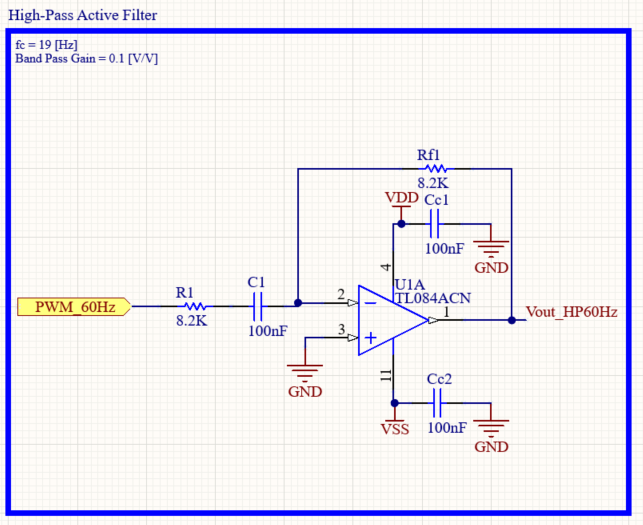
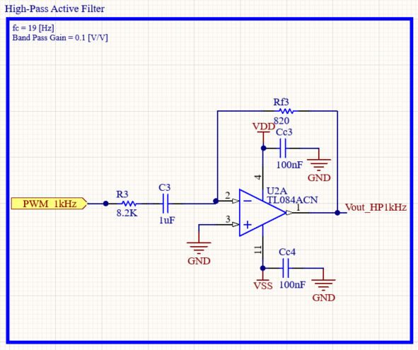

# Instrumentation Amplifier Test Bench with Microcontroller-Based Differential Signal Generator

#### Implementation of an instrumentation amplififer with PWM-generated differential and common-mode noise source


## Introduction

The aim of this repo is to help the hobbyist or student build a strong understanding of instrumentation amplifiers. It also presents a practical method to generate clean sinusoidal signals using a microcontroller and analog filtering techniques.


## Table of Contents


## System overview
### Basics of PWM

### Generating sinusoidal signals from filtered PWM carriers
The Arduino generates two high-frequency PWM carrier signals.

Instead of directly producing analog voltages, the PWM duty cycle is dynamically modulated using sinusoidal lookup tables.

After analog filtering, the low-frequency sinusoidal envelopes are recovered while the high-frequency PWM carriers are attenuated.

-Add Figure: 60Hz and 1kHz envelopes, their BP filters and visible attenuation of PWM frequency.

### Analog Filter Stages
#### First-order active high-pass filter
<p align="center">
  
  
</p>

The first-order active high-pass filters are used to attenuate low-frequency components and remove DC offsets before the low-pass reconstruction stages.

Transfer function:

$$
H(s)=\frac{-R_f C_1 s}{1+R_1 C_1 s}
$$

Cutoff frequency:

$$
f_c=\frac{1}{2\pi R_1 C_1}
$$


| Filter | Design cutoff frequency |
|---|---|
| 60 Hz path | 19 Hz |
| 1 kHz path | 19 Hz |


#### First-order active low-pass filter


The first-order active low-pass filter is used to attenuate the high-frequency PWM carrier while preserving the reconstructed sinusoidal envelope.

Transfer function:

$$
H(s)=\frac{-R_f}{R_2}\frac{1}{1+R_f C_f s}
$$

Cutoff frequency:

$$
f_c=\frac{1}{2\pi R_f C_f}
$$

| Filter | Design cutoff frequency |
|---|---|
| 60 Hz path | 164 Hz |


#### Second-order Sallen-Key low-pass filter


The second-order Sallen-Key low-pass filter is used to provide stronger attenuation of the high-frequency PWM carrier while preserving the 1 kHz sinusoidal envelope.

Transfer function:

$$
H(s)=\frac{1}{R_1 R_2 C_1 C_2 s^2 + (R_1 C_1 + R_2 C_1 + R_2 C_2)s + 1}
$$

Cutoff frequency:

$$
f_c=\frac{1}{2\pi\sqrt{R_1 R_2 C_1 C_2}}
$$

| Filter | Design cutoff frequency |
|---|---|
| 1 kHz path | 2 kHz |
```

### Differential signal generator


### Instrumentation Amplifier

## CMRR and Measured Performance

## Testing the Signal
### Viewing PWM carrier signals
### Viewing filtered sinusoidal signals
### Viewing noisy differential signals
### Viewing common-mode attenuation

## Hardware Implementation
### Breadboard Prototype
### PCB Design
#### Signal Generator

#### Instrumentation Amplifier

#### Performance

## Compatibility
## Safety