# Instrumentation Amplifier Test Bench with Microcontroller-Based Differential Signal Generator

#### Implementation of an instrumentation amplififer with PWM-generated differential and common-mode noise source

## Introduction

The aim of this repository is to help students, hobbyists and engineers build a practical understanding of instrumentation amplifiers (INAs). By exploring their ability to reject common-mode interference while preserving differential signal integrity, the reader will develop an understanding of their key role in signal acquisition and conditioning. The repository also includes a diferrential signal generator designed as a test bench for the instrumentation amplifier. Its design process is well documented for any reader interested in PWM-based signal synthesis, active analog filtering and frequency-domain validation using oscilloscope measurements and MATLAB.

Throughout this project, the reader will explore:
- Microcontroller-based PWM signal synthesis (Arduino Uno),
- First and second order active filters design for PWM-based sinusoidal signal synthesis,
- Theoretical Frequency domain analysis with Matlab and Altium Spice simulations,
- Experimental Frequency domain analysis of the synthesised signals and hardware (oscilloscope),
- Experimental instrumentation amplifier validation.

Project workflow:
1. Generate two PWM-modulated sinusoidal signals using an Arduino.
2. Reconstruct the sinusoidal envelopes through active analog filters.
3. Combine both signals into differential and common-mode components.
4. Characterize the generated signals using oscilloscope measurements and MATLAB.
5. Evaluate the instrumentation amplifier's ability to reject common-mode interference while preserving the differential signal.

> [!TIP]
> **Why generate sinusoidal test signals?**

>The instumentation amplifier can be though of as a building block of a signal acquisition circuit. Wires and PCB tracks are susceptible to ambient electromagnetic noise wich deteriorates the useful signal's integrity. The 60 Hz common mode signal used in the test bench is meant to represent the noise induced by the ambient power grid which has a sinusoidal shape. As for the usefull signal, its sinusidal shape is chosen for simplicity, but also because the signal's quality is easy to asses visualy.

> [!Note]
> While the complete PCB files are provided to allow readers to reproduce the project, the primary objective of this repository is educational. Readers are encouraged to adapt, improve, and experiment with the design rather than simply replicate it.

## Table of Contents

- [Introduction](#introduction)

- [System Overview](#system-overview)
  - [Generating Sinusoidal Signals from Filtered PWM Carriers](#generating-sinusoidal-signals-from-filtered-pwm-carriers)
  - [Analog Filter Stages](#analog-filter-stages)
    - [First-Order Active High-Pass Filter](#first-order-active-high-pass-filter)
    - [First-Order Active Low-Pass Filter](#first-order-active-low-pass-filter)
    - [Second-Order Sallen-Key Low-Pass Filter](#second-order-sallen-key-low-pass-filter)
  - [Differential Signal Generator](#differential-signal-generator)
  - [Instrumentation Amplifier](#instrumentation-amplifier)

- [CMRR and Measured Performance](#cmrr-and-measured-performance)

- [Testing the Signal](#testing-the-signal)
  - [Experimental PWM Signal Validation](#experimental-pwm-signal-validation)
  - [Viewing Filtered Sinusoidal Signals](#viewing-filtered-sinusoidal-signals)
  - [Viewing Differential Signals with Common Mode](#viewing-differential-signals-with-common-mode)
  - [Viewing Common-Mode Attenuation](#viewing-common-mode-attenuation)

- [Hardware Implementation](#hardware-implementation)
  - [Breadboard Prototype](#breadboard-prototype)
  - [PCB Design](#pcb-design)
    - [Signal Generator PCB](#signal-generator-pcb)
    - [Instrumentation Amplifier PCB](#instrumentation-amplifier-pcb)
    - [Performance](#performance)

- [Compatibility](#compatibility)
- [Safety](#safety)
- [Resources](#resources)
- [Acknowledgements](#acknowledgements)

## System overview

### Generating sinusoidal signals from filtered PWM carriers

The Arduino could generate a staircase approximation of a sinusoidal waveform directly from the lookup-table (LUT) values. However, the quantization and discrete-time updates inherent to a staircase waveform introduce additional spectral components. Since the objective is to characterize the INA, these imperfections would make it more difficult to distinguish distortion originating from the signal generator from distortion introduced by the instrumentation amplifier under test (See Figure 1).

  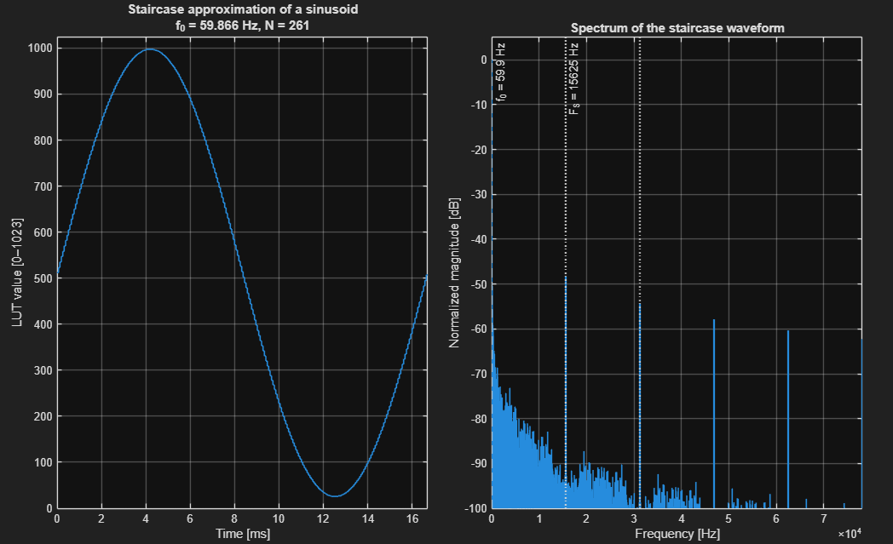

  <em>
    Figure 1. Staircase approximation of the 60 Hz sinusoidal signal
    generated from the lookup-table values and its normalized frequency
    spectrum (right). In addition to the desired fundamental component, the
    discrete update process produces high-frequency spectral images around
    the LUT update frequency.
  </em>

Instead, the sinusoidal lookup table is used to continuously adjust the duty cycle of a high-frequency PWM carrier. By shifting most of the unwanted spectral content around the PWM carrier frequency, analog reconstruction filters can effectively recover the low-frequency sinusoidal envelope.

The analog reconstruction filters are designed to:
- remove the DC component introduced by the PWM duty-cycle offset,
- preserve the desired sinusoidal envelope,
- attenuate the PWM carrier and its associated sidebands.

The figures below illustrate the signal generation process for the 60 Hz path.

#### Sinusoidal lookup table

The sinusoidal lookup table (LUT) defines the duty-cycle trajectory used to modulate the PWM carrier.

The LUT values are generated offline and embedded in the Arduino firmware through dedicated header files located in the firmware section of this repository. During operation, the microcontroller continuously updates the PWM duty cycle by stepping through the LUT entries.

Although Figure 2 displays a sinusoidal waveform for visualization purposes, no analog sinusoidal voltage is directly generated by the microcontroller. The only signal produced by the Arduino is a variable-duty-cycle PWM waveform whose average value follows the sinusoidal trajectory defined by the LUT.

After analog filtering, the low-frequency sinusoidal envelope is reconstructed while the high-frequency PWM carrier and its associated harmonics are attenuated.

  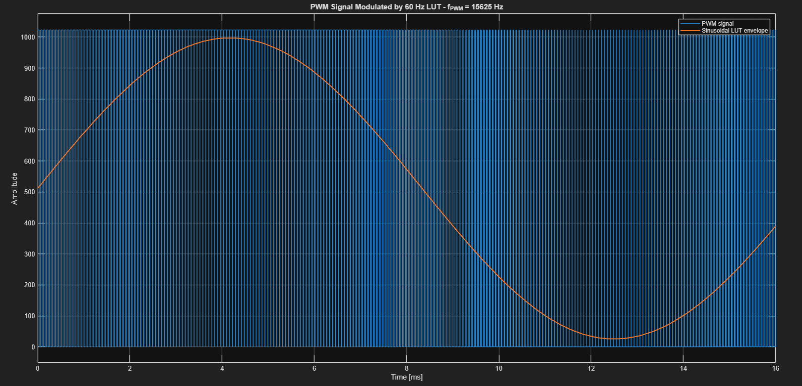

  <em>Figure 2. Time-domain representation of the 60 Hz lookup table and the corresponding PWM waveform.</em>

#### Frequency-domain analysis

Figure 3 shows the spectrum of the sinusoidal lookup table (LUT), revealing the desired 60 Hz component together with a large DC component resulting from the positive-only PWM duty-cycle range.

Figure 4 shows the spectrum of the corresponding PWM signal. After modulation, the desired 60 Hz component remains dominant, while harmonics introduced by the PWM process remain more than 40 dB below the fundamental component. The PWM carrier, however, also generates high-frequency spectral components around the carrier frequency (see Figure 5). These components are removed by the analog reconstruction filters, leaving only the desired low-frequency sinusoidal envelope.

  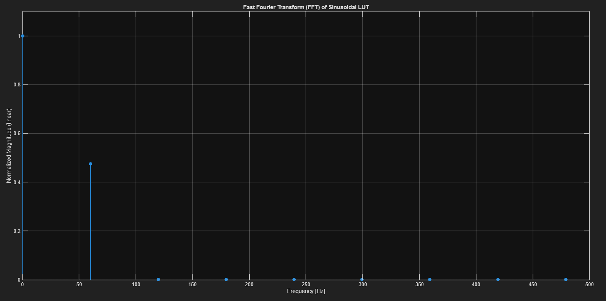
  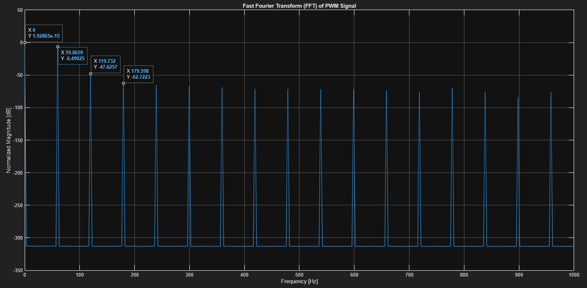

  <em>Figure 3. Frequency spectrum of the 60 Hz lookup table.</em> 
  <em>Figure 4. Frequency spectrum of the LUT-modulated PWM signal(0-1kHz).</em>

This frequency-domain view highlights two important design objectives:
- remove the DC component introduced by the PWM duty-cycle offset,
- attenuate the remaining harmonic content while preserving the desired 60 Hz sinusoidal component.

#### PWM spectrum and filter response

The figures below show the frequency response of the reconstruction filter superimposed on the spectrum of the LUT-modulated PWM signal.

Figure 5 shows the spectrum of the LUT-modulated PWM signal together with the reconstruction filter response over a wide frequency range. The PWM carrier and its associated sidebands can be observed at high frequencies. The reconstruction filter provides approximately 40 dB of attenuation at the carrier frequency, significantly reducing the PWM switching content.

Figure 6 focuses on the low-frequency region of interest. The DC component is strongly attenuated by the high-pass stage, while the desired 60 Hz component remains within the passband. The figure also highlights the large amplitude difference between the fundamental component and its harmonics, which are more than 40 dB below the 60 Hz signal.

  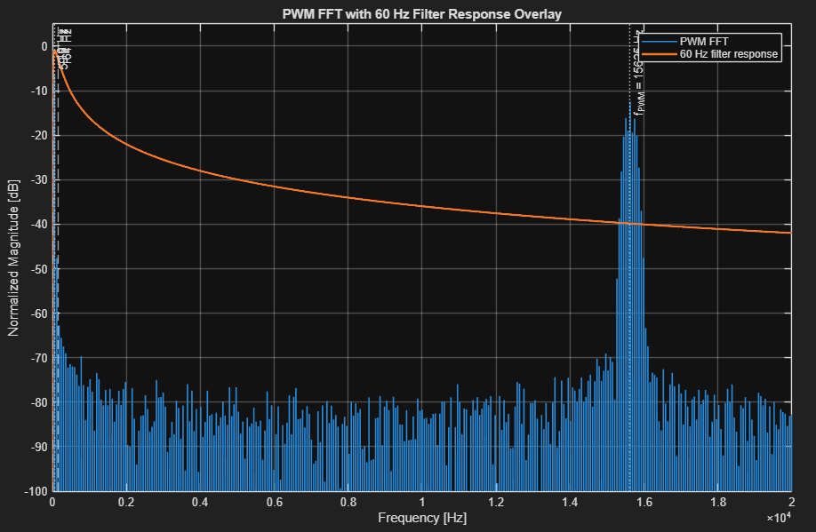
  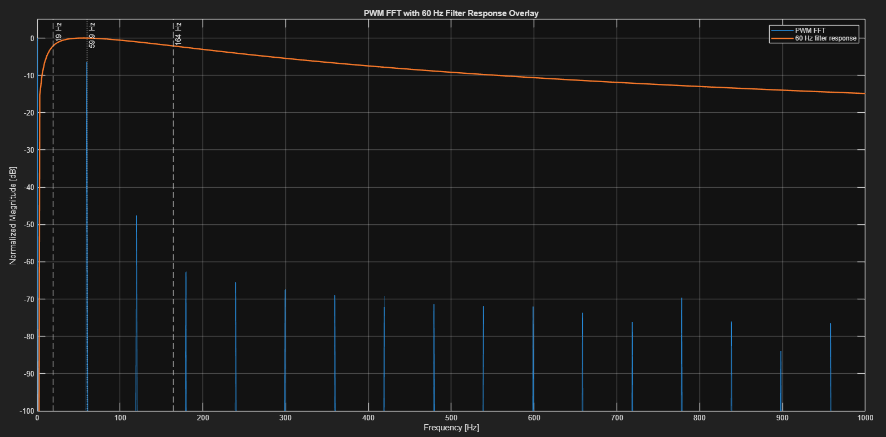

  <em>Figure 5. Reconstruction filter response superimposed on the spectrum of the LUT-modulated PWM signal.</em> 
  <em>Figure 6. Zoomed view of the low-frequency region showing the passband, DC attenuation and harmonic content.</em>

The resulting 19 Hz – 164 Hz band-pass response preserves the desired 60 Hz sinusoidal component while attenuating both the DC offset and the high-frequency PWM carrier. The origin of these cutoff frequencies is detailed in the Analog Filter Stages section.

This frequency-domain analysis provides valuable insight into the signal reconstruction process before any hardware measurements are performed.

#### 1 kHz signal path

The 1 kHz signal follows the same PWM reconstruction principle as the 60 Hz path. However, generating a 1 kHz sinusoid with the same timer configuration would provide too few duty-cycle updates per period, resulting in visible waveform distortion.

To increase the temporal resolution, the 1 kHz signal is generated using **Timer2** configured for **8-bit Fast PWM** at **62.5 kHz**. Although this reduces the PWM amplitude resolution from 10 bits to 8 bits, the fourfold increase in carrier frequency provides 64 PWM updates per sinusoidal period instead of only 16. This significantly improves the reconstructed waveform while keeping the analog filtering requirements manageable.

The figures below illustrate the frequency-domain behavior of the 1 kHz signal path.

  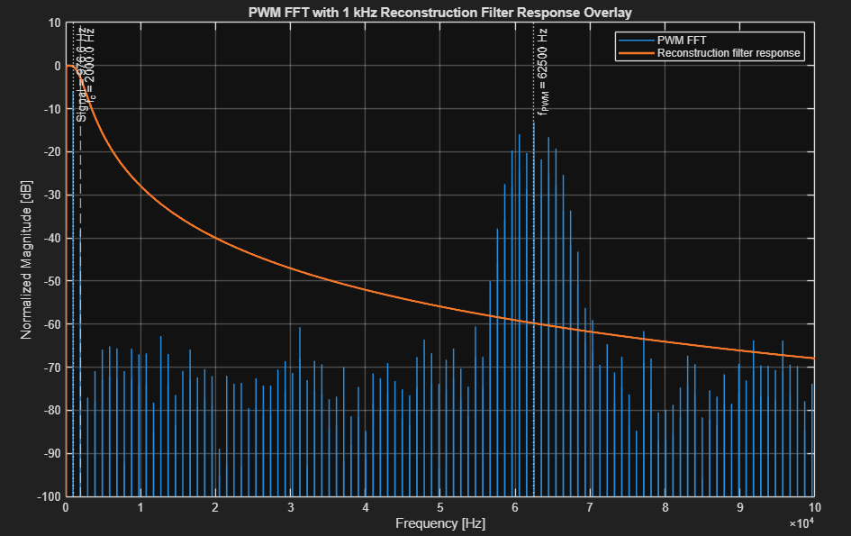
  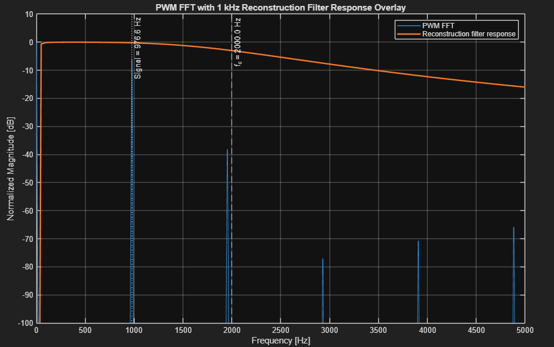

  <em>Figure 7. Reconstruction filter response superimposed on the 1 kHz PWM spectrum.</em> 
  <em>Figure 8. Zoomed view of the 1 kHz passband.</em>

### Analog Filter Stages
#### First-order active high-pass filter

  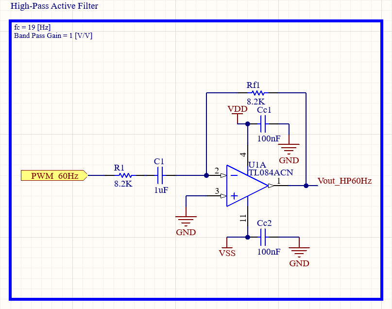
  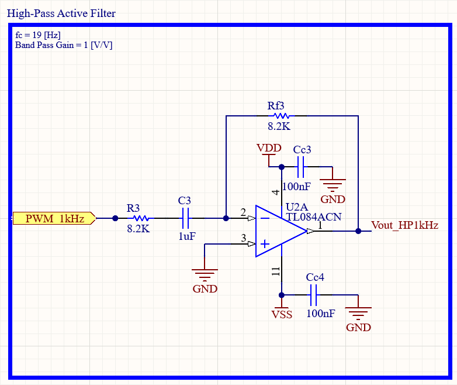

The first-order active high-pass filters are used to attenuate low-frequency components and remove DC offsets before the low-pass reconstruction stages.

Transfer function:

$$
H(s)=\frac{-R_f C_{in} s}{1+R_{in} C_{in} s}
$$

Cutoff frequency:

$$
f_c=\frac{1}{2\pi R_{in} C_{in}}
$$

| Filter | Design cutoff frequency |
|---|---|
| 60 Hz path | 19 Hz |
| 1 kHz path | 19 Hz |

#### First-order active low-pass filter

The first-order active low-pass filter is used to attenuate the high-frequency PWM carrier while preserving the reconstructed sinusoidal envelope.

Transfer function:

$$
H(s)=\frac{-R_f}{R_{in}}\frac{1}{1+R_f C_f s}
$$

Cutoff frequency:

$$
f_c=\frac{1}{2\pi R_f C_f}
$$

| Filter | Design cutoff frequency |
|---|---|
| 60 Hz path | 159 Hz |

#### Second-order Sallen-Key low-pass filter

The second-order Sallen-Key low-pass filter is used to provide stronger attenuation of the high-frequency PWM carrier while preserving the 1 kHz sinusoidal envelope.

Transfer function:

$$
T(s)=
\frac{\frac{K}{R_{4a}R_{4b}C^2}}
{s^2+s\frac{\frac{1}{R_{4a}}+\frac{2-K}{R_{4b}}}{C}
+\frac{1}{R_{4a}R_{4b}C^2}}
$$

where:

$$
K = 1+\frac{R_B}{R_A}
$$

$$
C_{4a}=C_{4b}=C
$$

Cutoff frequency:

$$
f_c=\frac{1}{2\pi\sqrt{R_{4a} R_{4b} C_{4a} C_{4b}}}
$$

| Filter | Design cutoff frequency |
|---|---|
| 1 kHz path | 2 kHz |

### Differential signal generator

> [!TIP]
> **Contributions welcome**
>
> This section is still under development.
>
> If you know of good references (books, application notes, university lectures, or papers) covering differential signal generation, common-mode signal injection, feel free to suggest them by opening an issue or submitting a pull request.

### Instrumentation Amplifier

The instrumentation amplifier (INA) is the device under test in this project. Its role is to amplify the differential component of the input signal (1kHz) while rejecting the common-mode interference (60Hz) intentionally injected by the differential signal generator. This makes the test bench suitable for experimentally demonstrating the Common-Mode Rejection Ratio (CMRR), one of the key performance metrics of instrumentation amplifiers.

The circuit is implemented using the classical three-op-amp topology. The first stage provides high input impedance together with programmable differential gain, while the second stage subtracts the two amplified input signals and rejects the common-mode component.

#### Differential gain

$$
A_d = \frac{R_2}{R_1}\left(1+\frac{R_3}{R_4/2}\right)
$$

#### Common-mode rejection ratio

$$
CMRR=\frac{A_d}{A_{cm}}
$$

or, in decibels,

$$
CMRR_{dB}=20\log_{10}\left(\frac{A_d}{A_{cm}}\right)
$$

**Recommended reference**

Sedra, A. S., Smith, K. C., *Microelectronic Circuits*, 7th Edition,
Section 2.4.2 – *A Superior Circuit: The Instrumentation Amplifier*, p. 82.

## CMRR and Measured Performance
> [!TODO]
> Basic protocol, Vin and Vout figures for V_{cm} an V_{dif}, result table, performance calculation

## Testing the Signal
### Experimental PWM Signal Validation

The PWM carrier signals were experimentally characterized using a Rigol DS1054Z oscilloscope. The acquired waveforms were exported as CSV files and processed in MATLAB to obtain their frequency spectra (Matlab figures are more fun to look at than oscilloscope screenshots).

For the **60 Hz** signal path, the PWM waveform clearly shows the low-frequency sinusoidal envelope modulating the high-frequency PWM carrier. The measured FFT confirms the presence of the desired 60 Hz component together with the PWM carrier, validating both the firmware implementation and the theoretical frequency-domain analysis.

For the **1 kHz** signal path, the corresponding FFT confirms the presence of the desired fundamental component at 976.6 Hz together with the harmonic content introduced by PWM modulation.

  
  

  <em>Figure 9. Measured unfiltered PWM waveforms for the 60 Hz and 1 kHz signal paths.</em>

  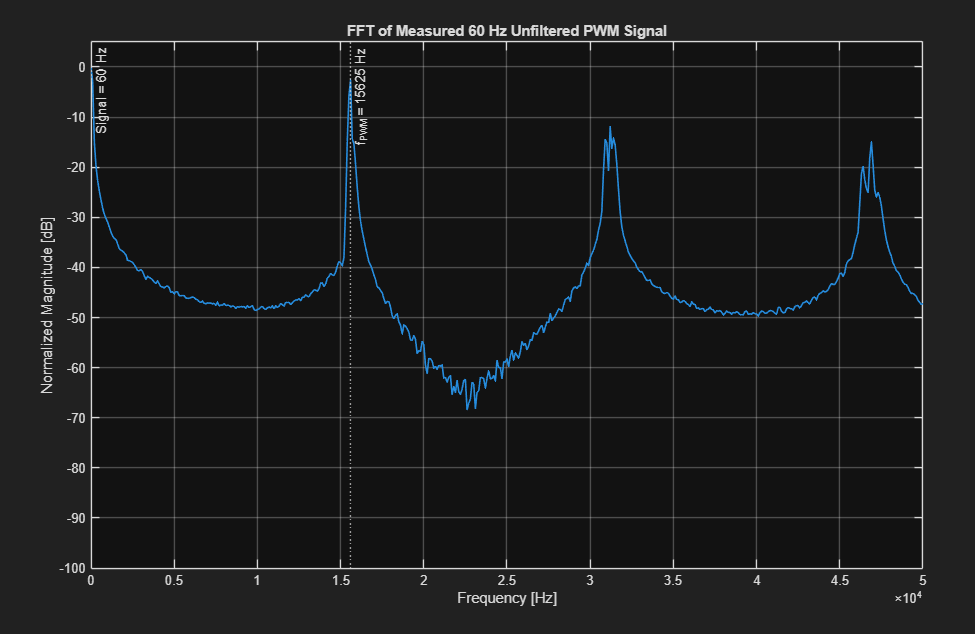
  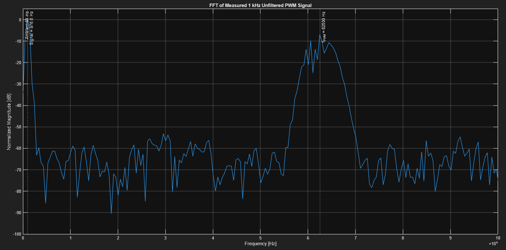

  <em>Figure 10. MATLAB FFT of the measured PWM waveforms prior to analog reconstruction filtering.</em>

These measurements validate the PWM generation firmware, the oscilloscope acquisition procedure, and the MATLAB analysis tools before evaluating the analog reconstruction filters.

### Viewing filtered sinusoidal signals

The two filtered outputs are used as the building blocks for the test signal:
- $V_{icm}$ : 60 Hz sinusoidal common-mode component
- $V_{id}$ : 1 kHz sinusoidal differential-mode component

  
  

The initial 1 kHz reconstruction exhibited visible distortion, most likely due to the limited number of PWM duty-cycle updates per sinusoidal period and insufficient attenuation of higher-order harmonics. The issue was resolved by configuring Timer2 for 8-bit Fast PWM operation, which increased the PWM carrier frequency and improved the separation between the desired signal and the carrier, making analog reconstruction significantly more effective.

### Viewing differential signals with common mode

The reconstructed 60 Hz common-mode component and the 1 kHz differential component are combined to generate the pair of input signals applied to the instrumentation amplifier, \(V_{id+}\) and \(V_{id-}\).

  
  

  <em>
    Figure 11. Measured outputs of the differential signal generator. Both
    outputs share the same 60 Hz common-mode component, while the 1 kHz
    differential component is applied with a 180° phase shift between
    \(V_{id+}\) and \(V_{id-}\). The full acquisition is shown on the left,
    while the zoomed view on the right highlights the differential voltage
    between the two outputs.
  </em>

### Viewing common-mode attenuation
> [!TODO]
> ScopeShot needed of differential signal with common mode... and Vout after the INA. To test on PCB!

## Hardware Implementation
### Breadboard Prototype

The complete signal generator was first assembled and validated on a solderless breadboard before the PCB was designed. This prototype allowed the analog filters and differential signal generation to be experimentally verified while providing a convenient platform for debugging and iterative improvements.

The breadboard implementation also facilitated oscilloscope measurements used throughout this repository to validate the theoretical analysis and guide the final hardware design.

  

  <em>
    Figure 12. Breadboard implementation of the differential signal generator
    used to validate the PWM reconstruction filters and the generated
    differential and common-mode signals prior to PCB fabrication.
  </em>

### PCB Design
> [!TODO]
> Order, build, test and Photoshoot!

#### Signal Generator PCB

#### Instrumentation Amplifier PCB

#### Performance
> [!TODO]
> Clean Table with Instrumentation Amplifier performance Acm, Ad, CMMR. To do with PCB!

## Compatibility
### Software

| Software | Version |
|----------|---------|
| Altium Designer | 26.5.1 (or later) |
| MATLAB | R2025b (or later) |
| Arduino IDE | 2.3.10 |
| Git | Any recent version |

### Hardware

| Item | Notes |
|------|------|
| Arduino Uno | ATmega328P, 16 MHz |
| Dual power supply | ±5 V |
| Oscilloscope | Any ≥20 MHz bandwidth |

## Safety

This project is intended for educational and laboratory use.

The signal generator and instrumentation amplifier operate from a **±5 V dual power supply**, making the circuit relatively safe to handle. Nevertheless, good laboratory practices should always be followed.

- Verify all wiring before powering the circuit.
- Double-check the polarity of the dual supply rails.
- Never exceed the absolute maximum ratings of the integrated circuits.
- Ensure that all instruments share a common reference when making oscilloscope measurements.
- Disconnect power before modifying the circuit or replacing components.

This repository does not involve mains voltages. The 60 Hz common-mode signal is **synthetically generated** and is **not** connected to the electrical power grid.

The authors assume no responsibility for damage to equipment or personal injury resulting from the misuse or modification of this design.

## Resources

Related instrumentation amplifier projects:

- [Laboratory Instrumentation Amplifier with 16-bit 1 MSPS ADC](https://github.com/drmcnelson/Laboratory-Instrumentation-Amplifier-with-16bit-1MSPS-ADC)
- [Design and Implementation of Instrumentation amplifier](https://github.com/GanderlaChaithanya/Design_and_Implementation_of_Instrumentation_amplifier)

## Acknowledgements

Parts of this project were inspired by laboratory material and concepts
developed for the course:

**GEL-3000 - Électronique des composants intégrés (Université Laval)**

Special thanks to:
- Prof. Benoit Gosselin
- Michelle Janusz
- Sébastien Rigaut
- Antoine Lefloïc

for their contributions to the original laboratory framework and educational material.

This repository extends and adapts those concepts into a standalone experimental
instrumentation amplifier and signal-generation test bench.

